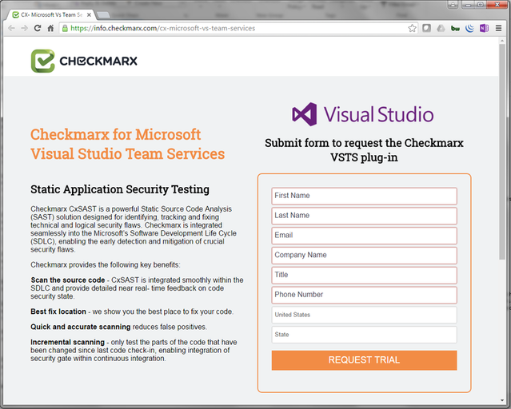
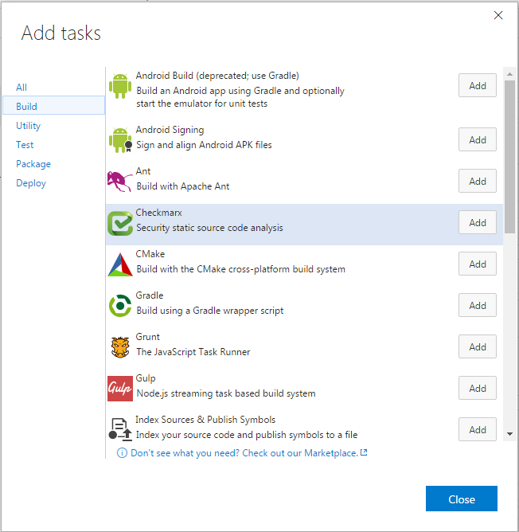

#Checkmarx Plug-in for Microsoft Visual Studio Team Services

Checkmarx is a powerful Static Source Code Analysis (SAST) solution designed for identifying, tracking and
fixing technical and logical security flaws.

Checkmarx is integrated seamlessly into the Microsoft’s Software Development Life Cycle (SDLC), enabling
the early detection and mitigation of crucial security flaws.

#Checkmarx provides the following key benefits:

- **Scan source code**
Integrates smoothly within the SDLC to provide detailed near real- time feedback on code security state
- **Best fix location**
Highlights the best place to fix your code
- **Quick and accurate scanning**
Reduce false positives, adapt the rule set to minimize false positives, and understand the root cause
for results
- **Incremental scanning **
Just test the parts of the code that have been changed since last code check-in to reduce scanning time by
more than 80%. Enables incorporation of the security gate within your continuous integration pipeline
- **Seamlessly integration**
Works with all IDEs, build management servers, bug tracking tools and source repositories

#Before You Start:

If you are a new user please submit the trial request registration form.
[link to Checkmarx registration page](https://info.checkmarx.com/cx-microsoft-vs-team-services)

#Checkmarx Registration:

**To complete this step:**
1.	Complete the form to request a Checkmarx trial license
2.	Activation may take a few days to set up your trial cloud account
    A Checkmarx representative will contact you with the trial license

#Getting Started with Checkmarx Plug-in:

The Checkmarx plug-in for Visual Studio Team Services is simple to install and configure.
The following steps are required to get started.

#Getting Started with Checkmarx Plug-in:

**To complete this step:**
1.	From the Build menu in the main screen, add Checkmarx build step
2.	Click Add to configure Checkmarx and configure the properties

#Configure Checkmarx Build Step

**To complete this step:**
To complete this step:
1.	CxServer
    a.	Select a Checkmarx Endpoint from the drop-down list or click Manage to associate a new Endpoint (described in the next section).
    b.	Enter a Project Name: Either select an existing project from the list, or type in any name to create a new scan project
    c.	Preset - predefined sets of queries that you can select when Creating, Configuring and Branching Projects. Predefined presets are provided by Checkmarx and you can configure your own. You can also import and export presets.
    d.	Team – which group the project is associated
    e.	Enable the Incremental Scan checkbox if you want to reduce time between scans
    f.	Enter how often a full scan is executed between incremental scans
    g.	Folder Exclusions – comma delineated list of the folders to exclude from the scan
    h.	File Exclusions – comma delineated list of the file extensions to exclude from the scan
    i.	Synchronous Mode – enabling this option will cause the build step to wait for scan results, you can see the scan results inside the Checkmarx plug-in results window. If disabled, the results are only displayed inside the Checkmarx web-application.
    j.	Vulnerability Threshold – Available only if Synchronous mode is enabled. Set the maximum number of vulnerabilities allowable before the scan fails
2.	Control options
    a.	Enabled - Clear this check box if you want to disable a step. This is a handy option if a step is not working correctly or if you need to focus on other parts of the process.
    b.	Continue on error –
    If an error occurs in this step, and this check box is:
    c.	Cleared: The build fails and no subsequent steps are run.
    d.	Selected: The build will be partially successful at best, and the next step is run
    e.	Always run – control option is enabled for the rollback task, so that the script can get executed when any of the tasks in the job fail.
    f.	Scan Timeout (hours) – enter the number of hours to allow the scan to run before timing out.

#Setup New Checkmarx End-Point

**To complete this step:**
1.	Enter Connection Name – Free text, for example: Checkmarx
2.	Enter Server URL – URL is provided by Checkmarx following registration
3.	Enter Username – is provided by Checkmarx following registration
4.	Enter Password – is provided by Checkmarx following registration
5.	Click OK to continue